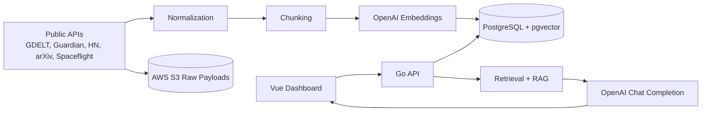

# SignalStack AI

SignalStack AI is a production-style multi-source news and research intelligence platform built with Go, Gin, Vue 3, TypeScript, PostgreSQL + pgvector, Docker, and GitHub Actions. It automatically ingests public content from five free APIs, normalizes everything into a common document format, chunks the content, generates embeddings, stores the results in PostgreSQL, and answers user questions with cited, retrieval-grounded responses.

## Problem Statement

Most RAG demos rely on user-uploaded documents and stop at toy-scale retrieval. SignalStack AI is designed to be resume-worthy and production-style: it runs its own ingestion pipeline, tracks measurable retrieval quality, stores raw source payloads in S3, and surfaces citations and latency metrics so the system can be evaluated like a real product.

## Key Features

- Automatic ingestion from GDELT, The Guardian, Hacker News, arXiv, and Spaceflight News.
- Shared internal document model for all sources.
- Chunking with overlap and token counts.
- pgvector-powered semantic retrieval with relevance thresholds.
- Cited answers with source title, URL, and similarity scores.
- Source chunk preview modal — view the exact retrieved text that grounded each answer.
- Chat session history and citation persistence.
- Evaluation dashboard with 20 pre-seeded benchmark questions and retrieval accuracy scoring.
- Dockerized local development and GitHub Actions CI.

## Tech Stack

- Backend: Go, Gin
- Frontend: Vue 3, TypeScript, Vite, Pinia, Vue Router
- Database: PostgreSQL, pgvector
- AI: OpenAI embeddings and chat completions
- Cloud: AWS S3, AWS RDS PostgreSQL, AWS EC2 or ECS
- DevOps: Docker, Docker Compose, GitHub Actions
- Auth: JWT

## System Architecture



## RAG Pipeline

1. Fetch raw content from the five public APIs.
2. Store the raw API response in S3.
3. Normalize all records into a common document schema.
4. Deduplicate by `external_id` and `content_hash`.
5. Clean and chunk the document text with overlap.
6. Generate embeddings for each chunk.
7. Persist chunks and embeddings in PostgreSQL + pgvector.
8. Embed the user query and run top-k similarity search.
9. If the top results are below the relevance threshold, return the insufficient-context message.
10. Otherwise, build a prompt from retrieved context only, generate an answer, and store citations.

The system prompt is intentionally strict:

> You are SignalStack AI. Answer the user’s question using only the retrieved source context. Include citations for every factual claim. If the context is insufficient, say you could not find enough relevant information in the indexed sources. Do not invent facts.

## API Sources Used

- GDELT API for global news and metadata.
- The Guardian Open Platform API for article text, tags, and sections.
- Hacker News API for stories and discussion threads.
- arXiv API for research titles, abstracts, and categories.
- Spaceflight News API for space and technology reporting.

## Database Schema Overview

- `users` for JWT-authenticated accounts.
- `sources` for enabled ingestion sources.
- `documents` for normalized source content.
- `document_chunks` for chunk text and pgvector embeddings.
- `ingestion_runs` for pipeline observability.
- `chat_sessions` and `chat_messages` for conversation history.
- `citations` for cited retrieval results.
- `evaluation_questions` and `evaluation_results` for benchmark tracking.

## Local Setup With Docker Compose

1. Copy `.env.example` to `.env` and fill in any keys you want to use.
   - `GUARDIAN_API_KEY` is the only external API key required for a full ingestion run. All other adapters use public keyless endpoints.
   - `OPENAI_API_KEY` is optional. Leave it empty to use the built-in deterministic fallback embedder (useful for local testing without an API bill).
   - `AWS_ACCESS_KEY_ID` / `AWS_SECRET_ACCESS_KEY` are optional. If empty, S3 raw-payload uploads are skipped silently and ingestion continues normally.
2. Start the stack:

```bash
docker compose up --build
```

3. Open the services:
   - Backend: http://localhost:8080
   - Frontend: http://localhost:5173

4. On first startup the PostgreSQL container automatically applies:
   - `backend/db/schema.sql` — creates all tables and the pgvector extension.
   - `backend/db/002-seed.sql` — seeds the 5 ingestion sources and 20 benchmark evaluation questions.

## Environment Variables

| Variable | Required | Default | Notes |
|---|---|---|---|
| `SERVER_ADDRESS` | No | `:8080` | Port the Go backend listens on |
| `DATABASE_URL` | Yes | — | Full PostgreSQL connection string |
| `POSTGRES_USER` | Yes | — | Used by Docker Compose to init the DB |
| `POSTGRES_PASSWORD` | Yes | — | |
| `POSTGRES_DB` | Yes | — | |
| `JWT_SECRET` | Yes | — | Use a long random string in production |
| `OPENAI_API_KEY` | No | `""` | Leave empty to use deterministic fallback embedder |
| `OPENAI_EMBEDDING_MODEL` | No | `text-embedding-3-small` | |
| `OPENAI_CHAT_MODEL` | No | `gpt-4o-mini` | |
| `AWS_ACCESS_KEY_ID` | No | `""` | Leave empty to skip S3 uploads |
| `AWS_SECRET_ACCESS_KEY` | No | `""` | |
| `AWS_REGION` | No | `us-east-1` | |
| `AWS_S3_BUCKET` | No | `signalstack-raw-responses` | |
| `GUARDIAN_API_KEY` | No | `""` | Free key from open-platform.theguardian.com — Guardian adapter is skipped if empty |
| `VITE_API_BASE_URL` | No | `http://localhost:8080` | Backend URL used by the Vue frontend |

## AWS Deployment

Recommended production layout:

- Store raw API payloads in S3.
- Use AWS RDS PostgreSQL with pgvector enabled.
- Deploy the Go backend to ECS or EC2.
- Deploy the Vue frontend to ECS, EC2, or a static hosting layer behind CloudFront.
- Keep JWT secrets and API keys in AWS Secrets Manager or SSM Parameter Store.
- Run ingestion through a scheduled job or worker so document counts stay fresh.

If full AWS orchestration is too heavy for a portfolio deployment, a simplified EC2 + Docker Compose deployment is acceptable as long as the backend, frontend, and database are containerized and the raw payloads still land in S3.

## Evaluation Methodology

The benchmark suite includes 20 pre-seeded questions spanning all five sources (seeded via `backend/db/002-seed.sql`). Each question stores:

- question text
- expected source
- expected keywords

Reported evaluation metrics:

- top-k retrieval accuracy
- average retrieval latency (ms)
- average answer latency (ms)
- citation count per question
- failed or weak retrieval count

## Metrics

The dashboard should track:

- documents ingested
- chunks generated
- embeddings generated
- active sources
- average retrieval latency
- average answer latency
- token usage
- source-level ingestion volume

## Screenshots

- Dashboard screenshot placeholder
- Ingestion monitoring screenshot placeholder
- Chat with citations screenshot placeholder
- Evaluation dashboard screenshot placeholder

## Future Improvements

- Add scheduled ingestion workers and queue-based retries.
- Add more robust OpenAI batching and embedding backoff.
- Add source-specific freshness and deduplication rules.
- Add observability with structured logs and tracing.
- Add full semantic search UI filters and citation drill-down.

## Resume Bullets

- Built a Go-based RAG intelligence platform that ingested 1,000+ articles, research papers, and tech discussions from 5 public APIs into PostgreSQL + pgvector.
- Generated 30,000+ vector embeddings and implemented top-k semantic retrieval with source citations, relevance scores, and latency tracking.
- Developed a Vue 3 + TypeScript dashboard for ingestion monitoring, cited AI answers, source previews, and retrieval evaluation metrics.
- Deployed containerized services with Docker, GitHub Actions, and AWS, enabling automated ingestion and production-style CI/CD workflows.

